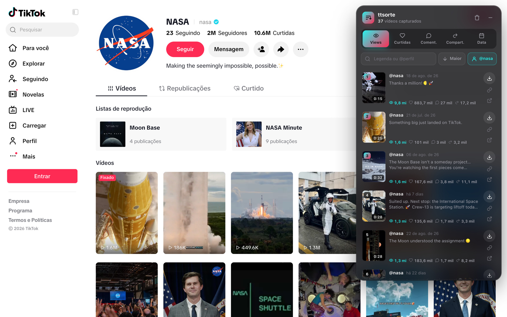
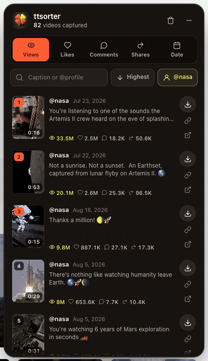
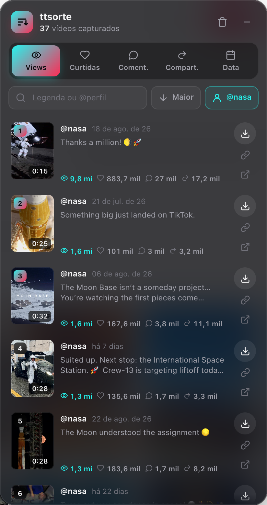

<div align="center">


# ttsorte

**Ordene vídeos do TikTok por views, curtidas, comentários, compartilhamentos ou data, e baixe em alta qualidade sem marca d'água.**

Grátis, open source, roda inteiro no seu navegador.

[](LICENSE)
[](https://developer.chrome.com/docs/extensions/develop/migrate/what-is-mv3)
[](https://github.com/Andrei-Alb/ttsorte/releases/latest)

[**⬇ Baixar a extensão**](https://github.com/Andrei-Alb/ttsorte/releases/latest/download/ttsorte.zip)

</div>

<br>



## O que ela faz

- **Captura sozinha** os vídeos conforme você rola o TikTok: perfil, Para Você, busca, hashtag, som.
- **Mostra as métricas** de cada vídeo num painel flutuante: visualizações, curtidas, comentários, compartilhamentos e data de postagem.
- **Ordena com um clique** por qualquer uma delas. Clicar de novo inverte a ordem.
- **Baixa o vídeo** sem marca d'água, na maior resolução que o TikTok oferece (até 1080p). Posts de foto baixam as imagens.
- **Filtra** por legenda ou @perfil. Na página de um perfil, mostra só os vídeos daquele perfil (o TikTok mistura recomendados de outras contas).

<table>
<tr>
<td width="50%" align="center"><br><sub>Ordenando e baixando</sub></td>
<td width="50%" align="center"><br><sub>O painel</sub></td>
</tr>
</table>

## Instalação

A extensão ainda não está na Chrome Web Store. A instalação manual leva um minuto:

1. Baixe o [**ttsorte.zip**](https://github.com/Andrei-Alb/ttsorte/releases/latest/download/ttsorte.zip) e descompacte numa pasta que você não vai apagar.
2. Abra `chrome://extensions` no navegador.
3. Ligue o **Modo do desenvolvedor**, no canto superior direito.
4. Clique em **Carregar sem compactação** e escolha a pasta descompactada (a que tem o `manifest.json`).
5. Abra o [TikTok](https://www.tiktok.com) e role. O painel aparece à direita.

Funciona em Chrome, Edge, Brave, Opera, Arc e outros navegadores baseados em Chromium.

<details>
<summary>Instalar a partir do código</summary>

```bash
git clone https://github.com/Andrei-Alb/ttsorte.git
```

Depois siga os passos 2 a 5 escolhendo a pasta `ttsorte/ttsorte`. Não tem build: o que está no repositório é o que roda.

</details>

## Como usar

| Ação | Como |
| --- | --- |
| Abrir ou fechar o painel | Clique no ícone da extensão, ou no botão flutuante no canto da tela |
| Ordenar | Clique em Views, Curtidas, Coment., Compart. ou Data |
| Inverter a ordem | Clique de novo na mesma aba, ou no botão Maior/Menor |
| Baixar | Botão de download do card; o anel mostra o progresso |
| Abrir o vídeo | Clique na miniatura ou no ícone de link externo (abre em nova aba) |
| Começar do zero | Ícone de lixeira no topo do painel |

Os vídeos capturados ficam só na aba aberta. Recarregou a página, a lista recomeça.

### Sobre a qualidade

A extensão escolhe a maior resolução disponível. Quando o TikTok oferece 1080p, o arquivo vem em **HEVC (H.265)**: abre normalmente no Mac, iPhone, Android e nos editores atuais, mas no Windows pode pedir a [Extensão de Vídeo HEVC](https://apps.microsoft.com/detail/9n4wgh0z6vhq). Sem 1080p, o arquivo vem em 720p H.264.

## Privacidade

Nada sai do seu navegador. Não há servidor, conta, telemetria nem analytics. A extensão lê as respostas que o próprio TikTok já entrega à página e baixa os vídeos com a sua sessão.

Permissões pedidas:

- `storage`: lembrar a ordenação escolhida e se o painel estava aberto.
- `downloads`: plano B de download quando o navegador bloqueia o caminho principal.
- Acesso a `www.tiktok.com`: o único site onde ela roda.

## Como funciona

```
ttsorte/
├── manifest.json
├── icons/
└── src/
    ├── hook.js         # MAIN world: lê a API do TikTok e faz o download
    ├── content.js      # painel (shadow DOM), ordenação, filtro, progresso
    ├── panel.css
    └── background.js   # ícone da extensão e download de reserva
```

- `hook.js` roda no contexto da página em `document_start` e intercepta `fetch`/`XMLHttpRequest` das rotas `/api/` do TikTok, além do JSON que vem renderizado no HTML. Cada item com `id`, `stats` e `video` vira um card. Anúncios são descartados.
- O download usa os links de reprodução (`playAddr` e `bitrateInfo`), que não têm marca d'água. O `downloadAddr`, que tem, nunca é usado. O arquivo é buscado com os cookies da própria página e salvo como blob; se isso falhar, o `background.js` passa o link pro gerenciador de downloads do navegador.
- O painel vive num shadow DOM, então o CSS do TikTok não vaza pra dentro nem o nosso pra fora.

Contribuições são bem-vindas. Abra uma issue antes de mudanças grandes.

## Aviso

O ttsorte não tem nenhuma relação com o TikTok ou a ByteDance. Use para baixar conteúdo seu ou que você tem permissão de usar, e respeite os direitos autorais de quem criou o vídeo. Se o TikTok mudar o site, a extensão pode parar de funcionar até ser atualizada.

## Licença

[MIT](LICENSE)
